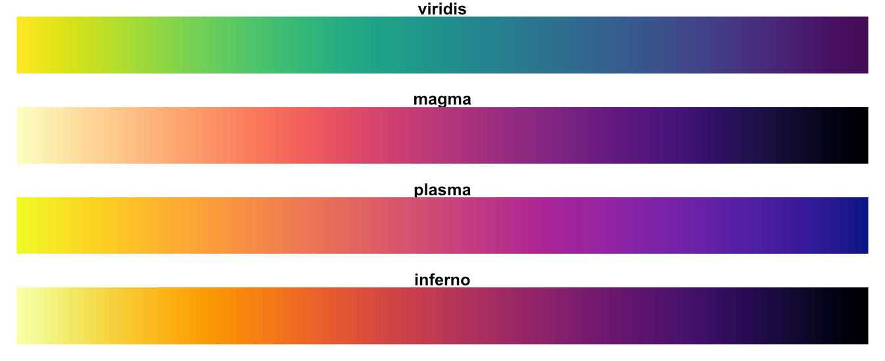

# sas-viridis
This repository contains a SAS macro for generating colors in the viridis color palette.

But what is the viridis color palette, and why should I care? The authors of the related R package describe it quite nicely. 

* **Colorful**, spanning as wide a palette as possible so as to make differences easy to see,
* **Perceptually uniform**, meaning that values close to each other have similar-appearing colors and values far away from each other have more different-appearing colors, consistently across the range of values,
* **Robust to colorblindness**, so that the above properties hold true for people with common forms of colorblindness, as well as in grey scale printing, and
* **Pretty**, oh so pretty.

The R package authors go on to provide a good explanation of why viridis (and its cousins) are superior to most other color palettes on [r-project](https://cran.r-project.org/web/packages/viridis/vignettes/intro-to-viridis.html). It's a good read if you have time. 

On the other hand, if you're ready to get started with the macro, feel free to jump straight to this repo's [wiki](https://github.com/RhoInc/sas-viridis/wiki).
